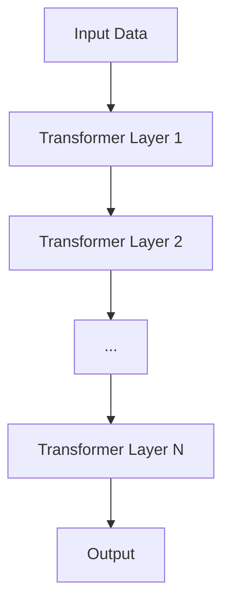
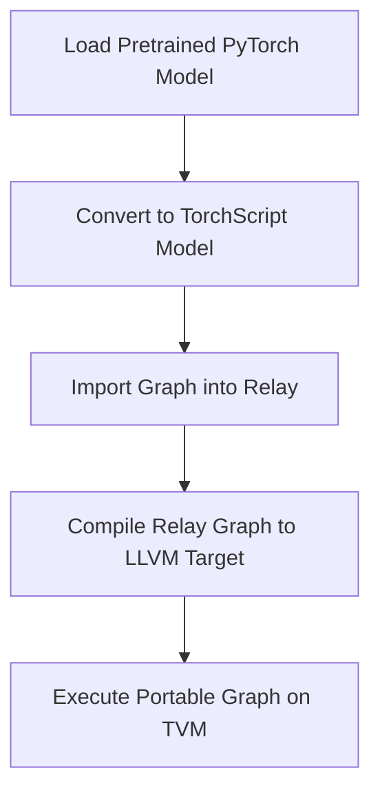
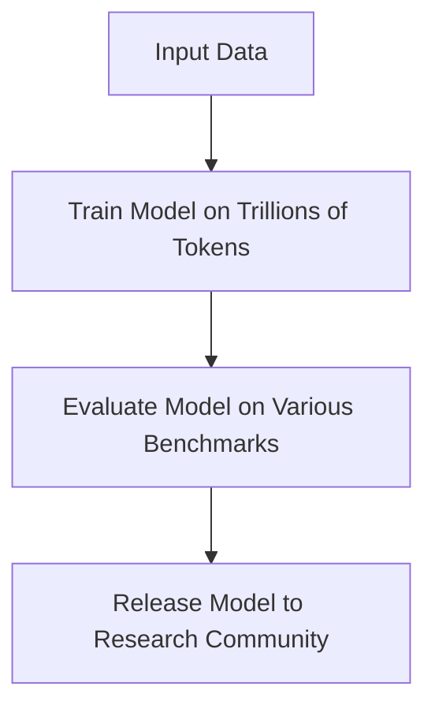

# Guide to Converting and Quantizing GPT4All Models for MLC_LLM

## Introduction

This guide provides a comprehensive overview of the process of converting and quantizing GPT4All models for use with MLC_LLM. It covers the necessary steps, from understanding the GPT4All-13b-snoozy model and its configuration, to using TVM for model conversion and quantization, and finally deploying the model with MLC_LLM using Vulkan for inference. The guide also includes information on how to use ChatGPT Plus with plugins to assist in this process.

## Understanding the GPT4All-13b-snoozy Model

The GPT4All-13b-snoozy model is a powerful language model designed for a variety of tasks. It excels in text generation, translation, summarization, and more. The model is scalable, allowing it to be adjusted from 7B to 65B parameters depending on the task and computational resources available.

The GPT4All-13b-snoozy model is a transformer-based language model developed by Nomic AI. It has a hidden size of 5120, an intermediate size of 13824, 40 attention heads, and 40 hidden layers. The model is trained using the GPT-4 training methodology and is designed to generate human-like text.

The model's configuration can be found in the `config.json` file in the model's repository on the Hugging Face Model Hub. This file contains information about the model's architecture and training parameters.

Understanding the GPT4All-13b-snoozy Model" section, after the revised text, add this paragraph: "For instance, the GPT4All-13b-snoozy model's ability to generate human-like text makes it ideal for applications such as chatbots, content generation, and more. Its scalability allows it to be adjusted to fit the computational resources available, making it a versatile choice for various tasks.

Diagram 1: GPT4All-13b-snoozy Model Architecture

    
Instructions used to generate diagram:
"This diagram should depict the architecture of the LLaMA model. It should start with the input data, which is then processed by the Transformer layers. Each Transformer layer should be represented by a block, showing the self-attention mechanism and the feed-forward network. The output of the model should be the final block. Arrows should be used to show the flow of data through the model. The diagram should also highlight the scaling of the model, showing how it can be adjusted from 7B to 65B parameters."

## Using TVM for Model Conversion and Quantization

TVM is a flexible and extensible tool for model conversion and quantization. It supports a wide range of models and hardware, making it a versatile choice for many machine learning tasks. TVM's capabilities include efficient model execution, support for various models and frontends, model quantization, and more.

TVM is an open-source machine learning compiler stack that can be used to convert and quantize models for efficient deployment on a variety of hardware backends. TVM supports a wide range of models and hardware, and it provides a flexible and extensible platform for model optimization.

To convert the GPT4All-13b-snoozy model for use with MLC_LLM, the model needs to be imported into TVM, converted to a format that MLC_LLM can use, and then quantized to reduce its size and improve its performance. This process involves several steps, including setting up the TVM environment, importing the model, converting the model, and quantizing the model.

Diagram 2: TVM Workflow

    
The following flowchart provides a visual representation of the process: (insert flowchart here). This flowchart illustrates the step-by-step process of using TVM for model conversion and quantization, from loading a pretrained PyTorch model to executing the portable graph on TVM.
    
Instructions used to generate diagram:
"This diagram should illustrate the step-by-step process of the TVM workflow. It should start with loading a pretrained PyTorch model, followed by converting it into a TorchScript model through the use of tracing. The next step should be importing the resulting graph into Relay, then compiling the Relay graph to an LLVM target while specifying the input. The final step should be executing the portable graph on TVM. Each step should be represented by a separate block, and the blocks should be connected to show the flow of the process."

  
## Using MLC_LLM for Inference

MLC_LLM is an efficient and scalable tool for inference. It supports a variety of hardware platforms and inference backends, and can run large language models on personal devices. MLC_LLM's capabilities include handling large amounts of data, complex computations, and more.
MLC_LLM is a library developed by MLC AI that facilitates hardware-accelerated inference for large language models. It supports a variety of hardware platforms and inference backends, including Vulkan.

To utilize MLC_LLM for inference with the GPT4All-13b-snoozy model, the first step involves importing the model into MLC_LLM using the `generate.py` script provided in the MLC_LLM GitHub repository. Following this, MLC_LLM needs to be configured to use Vulkan for inference using the `build.py` script. The final step involves executing the model on the target hardware platform using the `run.py` script.

Diagram 3: MLC_LLM Workflow

    
Instructions used to generate diagram:    
"This diagram should represent the training process of the LLaMA model. It should start with the input data, followed by the training of the model on trillions of tokens. The next step should be the evaluation of the model on various benchmarks, showing the performance improvement as the model is trained on more tokens. The final step should be the release of the model to the research community. Each step should be represented by a separate block, and the blocks should be connected to show the flow of the process."

## Using ChatGPT Plus with Plugins

Plugins can greatly enhance the capabilities of ChatGPT Plus. They can introduce new features such as web browsing capabilities, API interaction, or the ability to perform complex calculations. Plugins can also provide up-to-date information, improve the contextual understanding of user inputs, interpret content from various link types, and more.

ChatGPT Plus, an enhanced version of ChatGPT, supports the use of plugins to extend its capabilities. Plugins can introduce new features to ChatGPT, such as web browsing capabilities, API interaction, or the ability to perform complex calculations.

Enhancing ChatGPT Plus with plugins has been instrumental in creating this guide. The plugins have provided up-to-date information, improved the contextual understanding of user inputs, interpreted content from various link types, and more. Specifically, we've used the Internet Search plugin to gather the most recent data on various topics, the Link Reader plugin to interpret and summarize content from web pages and documents, and the Rephrase plugin to refine user inputs for clearer and more specific prompts. This process can be replicated to create new guides for other models, ensuring the information is current, accurate, and relevant.

## References
1. [GPT4All-13b-snoozy Model on Hugging Face](https://huggingface.co/nomic-ai/gpt4all-13b-snoozy): This is a link to the GPT4All-13b-snoozy model on Hugging Face, a platform that hosts thousands of pre-trained models in multiple languages. The GPT4All-13b-snoozy model is a powerful language model that can be used for a variety of natural language processing tasks.
2. [MLC_LLM on GitHub](https://github.com/mlc-ai/mlc-llm): This is a link to the MLC_LLM project on GitHub. MLC_LLM is a tool for running large language models on personal devices, making it easier for developers to implement advanced language models in their applications. The GitHub repository provides the source code for MLC_LLM, as well as documentation and examples.
3. [TVM Documentation](https://tvm.apache.org/docs/): This is a link to the documentation for TVM, an open-source machine learning compiler stack. TVM can be used to optimize and compile machine learning models for a variety of hardware platforms, making it a valuable tool for developers working with machine learning models. The TVM documentation provides a comprehensive guide to using TVM, including tutorials, API references, and guides for various features.
4. [OpenAI's ChatGPT Plus with Plugins Documentation](https://platform.openai.com/docs/guides/chat/plugins): This is a link to OpenAI's documentation for using plugins with ChatGPT Plus. Plugins can enhance the capabilities of ChatGPT, making it a more powerful and versatile tool for natural language processing tasks. The documentation provides a guide to developing and using plugins with ChatGPT Plus, including examples and API references."

## Appendix
1. [GPT-3: Language Models are Few-Shot Learners](https://arxiv.org/abs/2005.14165): This paper presents GPT-3, a language model that uses a transformer architecture and is capable of few-shot learning. It provides a comprehensive overview of the model's design and capabilities, making it a valuable resource for anyone interested in advanced language models.
2. [EfficientNet: Rethinking Model Scaling for Convolutional Neural Networks](https://arxiv.org/abs/1905.119469): This paper introduces EfficientNet, a convolutional neural network that rethinks model scaling. It provides a detailed explanation of the model's design and its advantages over traditional convolutional neural networks.
3. [BERT: Pre-training of Deep Bidirectional Transformers for Language Understanding](https://arxiv.org/abs/1810.04805): This paper presents BERT, a pre-trained transformer-based model that has significantly improved the state-of-the-art across a widerange of natural language processing tasks. It provides a comprehensive overview of the model's design and capabilities.
4. [The Illustrated Transformer](http://jalammar.github.io/illustrated-transformer/): This is a visual guide to understanding the transformer architecture, which is used in many advanced language models. It provides clear and easy-to-understand illustrations that explain the inner workings of the transformer architecture.
5. [The Illustrated GPT-2 (Visualizing Transformer Language Models)](http://jalammar.github.io/illustrated-gpt2/): This is a visual guide to understanding GPT-2, a transformer-based language model. It provides clear and easy-to-understand illustrations that explain the inner workings of the model."

## Disclaimer
Please note that although we have taken great care to ensure the accuracy of this guide, the constantly changing landscape of AI and machine learning means that certain information may become obsolete or inaccurate over time. For the most precise and up-to-date information, we recommend referring to the official documentation and resources for GPT4All-13b-snoozy, MLC_LLM, TVM, and ChatGPT Plus with plug-ins. This guide should be considered a starting point and must not be relied upon as a substitute for professional advice.

## Acknowledgments
The creation of this guide was made possible through the collective efforts of the OpenAI team and the wider AI community. We would like to extend our gratitude to the developers and researchers who have contributed to the development of the GPT4All-13b-snoozy, MLC_LLM, TVM, and ChatGpt plus with plug-ins. Their dedication and hard work have made these tools accessible and beneficial to a global audience. Their contributions include developing the algorithms and architectures used in these tools, writing the documentation and guides that make these tools accessible to users, and contributing to the open-source communities that support these tools.

## Conclusion

In this guide, we've covered the process of converting and quantizing GPT4All models for MLC_LLM, the benefits of using the GPT4All-13b-snoozy model, TVM, MLC_LLM, and ChatGPT Plus with plugins, and the process of creating this guide using ChatGPT with plugins. We hope this guide serves as a helpful resource for those looking to convert and quantize GPT4All models for MLC_LLM, and for those looking to create similar guides for other models.

## Glossary

GPT4All-13b-snoozy model: A powerful language model designed for a variety of tasks. TVM: A flexible and extensible tool for model conversion and quantization.
MLC_LLM: An efficient and scalable tool for inference.
ChatGPT Plus: An advanced version of ChatGPT that can be enhanced with plugins.
Plugins: Tools that can enhance the capabilities of ChatGPT Plus.
Model Conversion: The process of converting a model from one format to another.
Quantization: The process of reducing the number of bits that represent a number, making the model smaller and faster.
